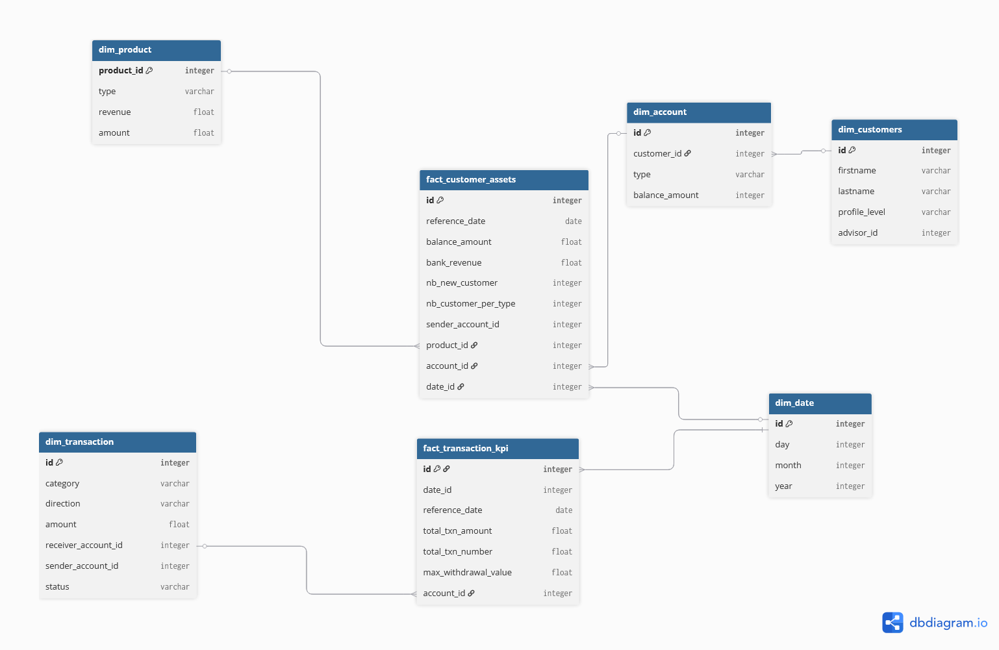

# FineFinance Data Platform Project

## 📊 Business Context Overview

**FineFinance** is a customer-to-customer (C2C) fintech platform providing digital banking services, including peer-to-peer transfers, investment planning, and credit services. As a new and growing company, FineFinance aims to build a modern data platform that supports real-time insights, customer value segmentation, and strategic business decisions.

To enable personalized customer experiences and support data-driven decision-making across teams, we are building a robust **data stack** using:

- **PostgreSQL** as the operational data source
- **Airbyte** for data ingestion
- **Snowflake** as the cloud data warehouse
- **dbt** for data transformation and modeling
- **Apache Airflow** for orchestration and scheduling

This project is designed to **learn new skills in data engineering** while addressing needs in finance domain in which I started my career.

---

## 👥 User Stories & Data Needs

### 🔹 Customers
| As a... | I want to... | So that... |
|--------|---------------|-------------|
| Customer | Download my **monthly account statement** | I can track spending and maintain records |

---

### 🔹 Bank Advisors
| As a... | I want to... | So that... |
|--------|---------------|-------------|
| Advisor | See customers with **high withdrawals, loans, or investments** for 3+months | I can offer them upgraded services |
| Advisor | See customers who were **in the red** for 3+ months | I can offer budgeting support or financial products |

---

### 🔹 Bank Direction / Business Intelligence
| As a... | I want to know... | So that... |
|--------|--------------------|-------------|
| Bank Director | **Monthly growth metrics** (revenue, transaction volume, new customers) | I can evaluate overall business performance |
| Bank Director | The **number of customers per profile** (Bronze, Gold, Diamond) | I can assess customer segmentation |
| Bank Director | The **evolution of transactions per month** | I can track customer engagement and activity |

---

## 📁 Project Structure 
/fineFinance/  
├── ingestion/  
├── orchestration/  
├── postgresScripts/ (contains schema and table creation)  
├── snowflakeScripts  
├── transformation/  
├── docker-compose.yml  
└── README.md  

---

## 🚀 Data Stack Overview

| Layer            | Tool           | Description |
|------------------|----------------|-------------|
| Source DB        | PostgreSQL     | Operational banking data |
| Ingestion        | Airbyte        | Sync from Postgres to Snowflake |
| Warehouse        | Snowflake      | Scalable analytical database |
| Transformation   | dbt            | Transform raw data into analytics-ready models |
| Orchestration    | Airflow        | Manages the entire pipeline |

---
## ❄️ Snowflake Data warehouse model

---

## 🔧 Setup Instructions (coming soon)

- How to run locally with Docker
- Airbyte source/destination configuration
- dbt models and profiles
- Airflow DAGs

---

## 📈 Dashboards & Analytics (planned)

- Monthly Statement Explorer
- Customer Health & Risk Scoring
- Advisor Portfolio Summary
- Business KPI Trends

---

## 🧪 Test Coverage (planned)

- dbt tests on freshness, uniqueness, and nulls
- Integration tests in DAGs
- Data quality alerts

---

## 🤝 Contributing

This project is part of a personal learning journey in data engineering. Contributions, feedback, and collaboration ideas are welcome.

